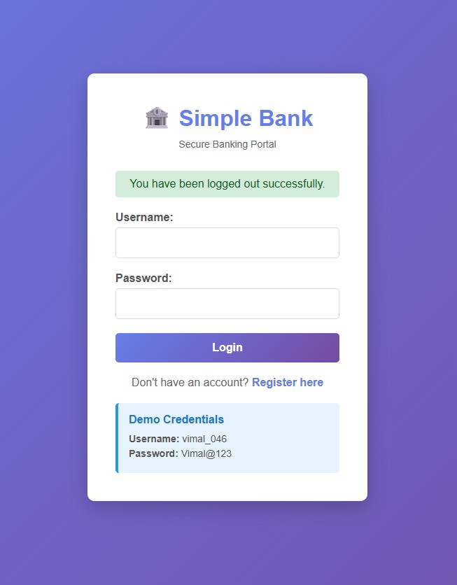
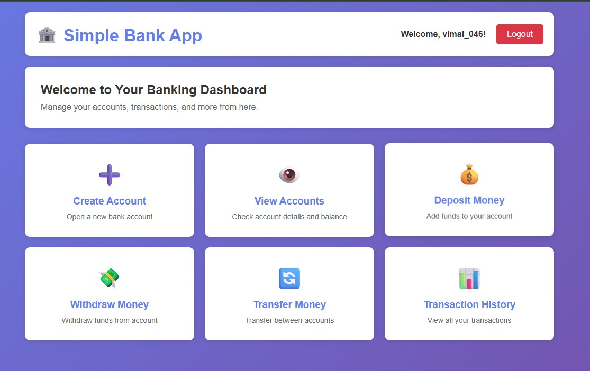
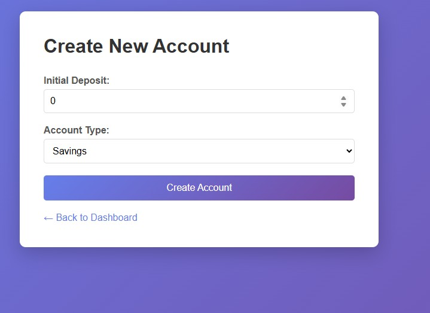
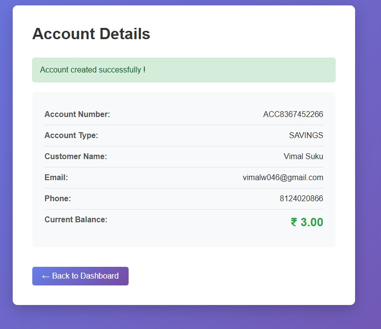
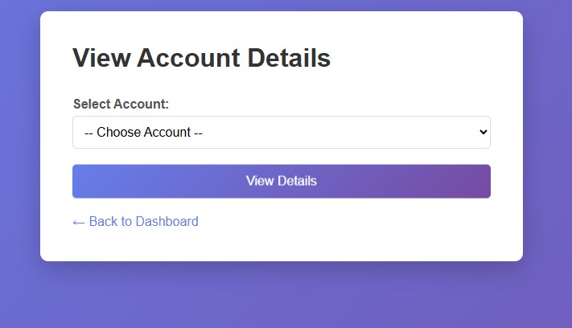
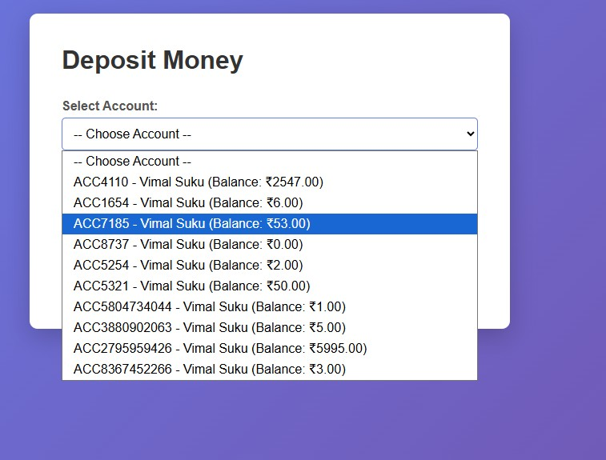
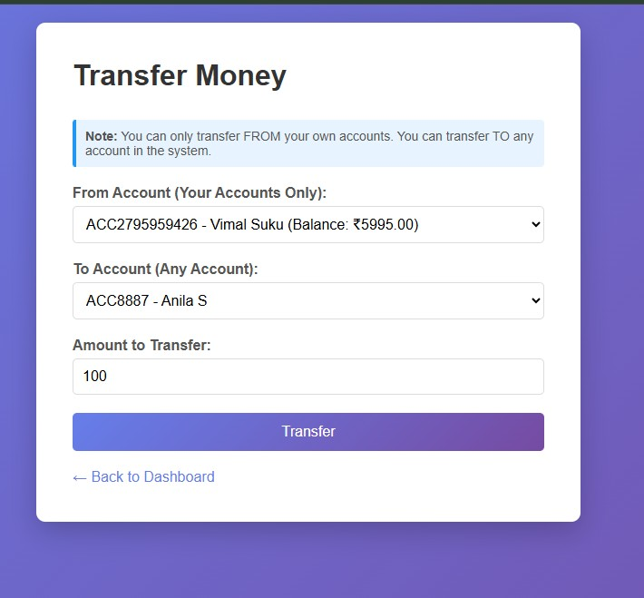
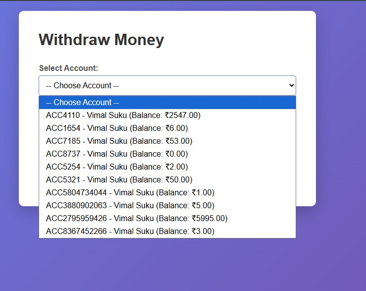
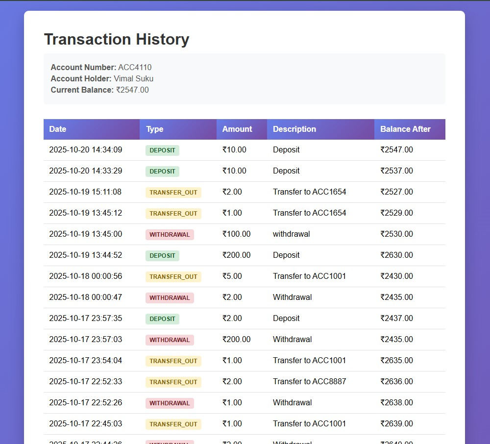

# SimpleBankApp

A simple banking application built with **Spring MVC**, **Spring JDBC**, and **Thymeleaf**.  
This project allows users to register, log in, create accounts, deposit, withdraw, transfer money, and view transaction history with session-based security.

---

## 📌 Features

- User registration and login with session management
- Create bank accounts and view account details
- Deposit and withdraw money
- Transfer funds between accounts
- View transaction history
- User isolation: each user sees only their own accounts
- Passwords stored securely (hashed)
- Request and response logging for debugging
- Simple, clean HTML/Thymeleaf UI

---

## 🛠️ Technologies Used

- **Backend:** Java, Spring MVC, Spring JDBC, Spring Interceptor  
- **Frontend:** Thymeleaf, HTML, CSS  
- **Database:** MySQL  
- **Build Tool:** Maven  
- **Server:** Apache Tomcat  

---

## 📂 Project Structure
SimpleBankApp/
├── src/main/java
│ ├── model/
│ ├── dao/
│ ├── service/
│ ├── controller/
│ └── interceptor/
├── src/main/resources
│ ├── spring-servlet.xml
│ ├── logback.xml
│ └── web.xml
├── src/main/webapp/WEB-INF/views/
│ ├── login.html
│ ├── register.html
│ ├── dashboard.html
│ ├── create-account.html
│ ├── view-account.html
│ ├── account-details.html
│ ├── deposit.html
│ ├── withdraw.html
│ ├── transfer.html
│ ├── transaction-history-form.html
│ └── transaction-history.html
└── README.md

---

## 🖼️ Screenshots

**Login Page**  

**Registration Page**  

**Dashboard**  

**Create Account**  

**View Account**  

**Deposit / Withdraw / Transfer**  

**Transaction History**  

## ⚡ Getting Started

### 1. Clone the repository

git clone https://github.com/vimal046/SimpleBankApp.git
cd SimpleBankApp
2. Setup Database

Create MySQL database simplebankdb

Import schema.sql and sample-data.sql (if provided)

Update MySQL username/password in spring-servlet.xml

3. Build and Deploy

Build project with Maven:

mvn clean install

Deploy to Tomcat server

Access the app at: http://localhost:8080/SimpleBankApp/

#### ✅ Functional Verification

Register new user

Login with credentials

Create a bank account

Deposit money

Withdraw money

Transfer money

View transaction history

Logout

Each action is logged in the console and database for verification.

#### 🔒 Security

Only authenticated users can access protected routes

Users can see and operate only on their own accounts

Logout clears session

Passwords stored as hashed values

#### 📖 Notes

Make sure Tomcat is running on port 8080

All pages use Thymeleaf templates under /WEB-INF/views/

Logs stored under logs/ directory
